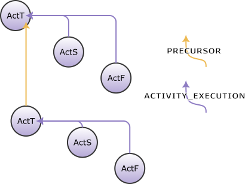
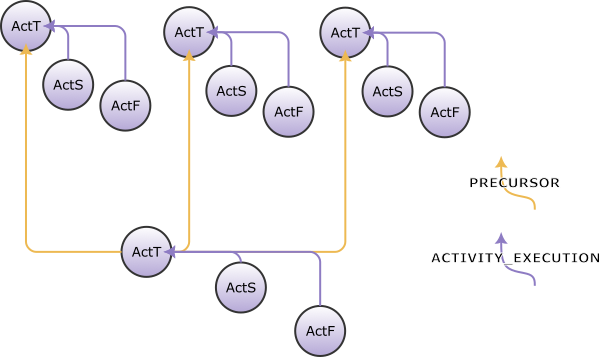

<!---
   Copyright 2022 Ericsson AB.
   For a full list of individual contributors, please see the commit history.

   Licensed under the Apache License, Version 2.0 (the "License");
   you may not use this file except in compliance with the License.
   You may obtain a copy of the License at

       http://www.apache.org/licenses/LICENSE-2.0

   Unless required by applicable law or agreed to in writing, software
   distributed under the License is distributed on an "AS IS" BASIS,
   WITHOUT WARRANTIES OR CONDITIONS OF ANY KIND, either express or implied.
   See the License for the specific language governing permissions and
   limitations under the License.
--->

# Activity Linking
_Activity linking_ is the act of connecting [activities](../eiffel-syntax-and-usage/glossary.md#activity) within a [pipeline](../eiffel-syntax-and-usage/glossary.md#pipeline) to each other. It includes not just linking pipeline steps to each other, but also linking hierarchically, such as an overall pipeline activity, a set of sub activities for a build or a test, or linking multiple complete pipelines to each other.

Activity links are important both for tracing what activity/activities preceded a certain activity or what activity/activities followed after a certain activity, but also for tracing a full chain of parallel/serial activities within a pipeline. Tracing the activities in pipelines is the base for various kinds of pipeline visualizations and also for metrics and KPI measurements.

## Event Driven vs Orchestrated Pipeline
A _fully event driven pipeline_ in Eiffel terminology is a pipeline where _all_ activities in it are triggered explicitly by Eiffel events. Those events could either come from earlier pipeline steps, or from other pipelines producing for example artifacts that this pipeline would be configured to trigger on.

A _fully orchestrated pipeline_ is completely controlled by a dedicated pipeline orchestrator, such as Jenkins Pipeline or Argo Workflows, and has no activities triggered by Eiffel events. A fully orchestrated pipeline is probably often initiated by a source change in some SCM system, and that source change is then propagated to the pipeline orchestrator through some non-Eiffel-event channel (e.g. an Github web hook or a Gerrit stream-event)

None of the scenarios above is probably relevant for most of the Eiffel event users, but rather a combination of the two where a pipeline is often _triggered_ by an Eiffel event, but then an orchestrator deals with controlling (at least parts of) the pipeline. Such triggers could for example be SCM events (e.g. [SCC](../eiffel-vocabulary/EiffelSourceChangeCreatedEvent.md)/[SCS](../eiffel-vocabulary/EiffelSourceChangeSubmittedEvent.md)) or artifact events (e.g. [ArtC](../eiffel-vocabulary/EiffelArtifactCreatedEvent.md)/[ArtP](../eiffel-vocabulary/EiffelArtifactPublishedEvent.md)/[CLM](../eiffel-vocabulary/EiffelConfidenceLevelModifiedEvent.md)).

To handle the different possible scenarios for pipeline execution, multiple link types are defined in the Eiffel protocol used for linking to and from activity events.

## Link Types Involved
This section describes the main link types involved in linking activities in pipelines

### CAUSE
Identifies the cause of the event occurrence, in the situations where the cause is an Eiffel event. This link type is not relevant only for EiffelActivity\*Events, but for any Eiffel event that represent an [occurrence](#occurrence) that was caused by an earlier Eiffel event.

__Required:__ No  
__Legal sources:__ Any  
__Legal targets:__ Any  
__Multiple allowed:__ Yes  

### PRECURSOR
This link type is used to declare *temporal relationships* between activities in a pipeline, i.e. what other activity (or activities) preceded this activity.

An activity could have multiple PRECURSOR activities, which means that the activity was triggered in serial after a certain group of parallel activities where triggered. This can be used to declare merge points of a group of parallel activities into a succeeding activity.

The fact that a certain activity is triggered, having some preceding activity/activities as PRECURSOR(s) does not in itself mean that the preceding activity/activities is/are finished before this activity was triggered. It merely means that it was triggered *after* that/those other activity/activities where triggered.

PRECURSOR links are only valid to be used on the triggering event of an activity, i.e. on EiffelActivityTriggeredEvent or on EiffelTestSuiteStartedEvent, and the target of this link type shall also be the triggering event of the preceding activity/activities.

This link type is relevant mostly to non event-triggered activities. It is though recommended to also use it for event-triggered activities, as it helps to visualize the full chain of activities in a pipeline in a common way regardless of how each activity was triggered. By always providing PRECURSOR links between activities, a visualization tool does not need to follow any CAUSE links in order to visualize the activity relationships.

For event links between serially executed pipelines, e.g. when a source change in an integration repository is automatically created by an update to an upstream dependency for that integration, there would be a CAUSE link to the event notifying that updated dependency. The protocol currently does not recommend to use a PRECURSOR link in that scenario.

__Required:__ No  
__Legal sources:__ [EiffelActivityTriggeredEvent](../eiffel-vocabulary/EiffelActivityTriggeredEvent.md),
[EiffelTestSuiteStartedEvent](../eiffel-vocabulary/EiffelTestSuiteStartedEvent.md)  
__Legal targets:__ [EiffelActivityTriggeredEvent](../eiffel-vocabulary/EiffelActivityTriggeredEvent.md),
[EiffelTestSuiteStartedEvent](../eiffel-vocabulary/EiffelTestSuiteStartedEvent.md)  
__Multiple allowed:__ Yes  

### CONTEXT
This link type is used to declare *hierarchies* of activities within a pipeline. The CONTEXT identifies the activity or test suite of which this event constitutes a part.
For example:
- This *pipeline step* is executed in the *CONTEXT* of that *pipeline*, i.e. the pipeline step is part of a certain pipeline, and the ActT event of the pipeline step SHOULD have a CONTEXT link to the ActT event of the pipeline itself.
- This *test suite* is executed in the *CONTEXT* of that *pipeline step*, i.e. the test suite is executed within a certain pipeline step, and the TSS event for the test suite SHOULD then have a CONTEXT link to the ActT event of the pipeline step.
- This *artifact* was built within the *CONTEXT* of that *pipeline step*, i.e. the ArtC event SHOULD have a CONTEXT link to the ActT event of the pipeline step.

__Required:__ No  
__Legal sources:__ Any  
__Legal targets:__ [EiffelActivityTriggeredEvent](../eiffel-vocabulary/EiffelActivityTriggeredEvent.md),
[EiffelTestSuiteStartedEvent](../eiffel-vocabulary/EiffelTestSuiteStartedEvent.md)  
__Multiple allowed:__ Yes  

### FLOW_CONTEXT
This link type is not related to activity linking, but is mentioned here is it could be confused with the CONTEXT link type. The FLOW_CONTEXT identifies the flow context of the event, e.g. which product, project, track or version this event is applicable to.

__Required:__ No  
__Legal sources:__ Any  
__Legal targets:__ [EiffelFlowContextDefinedEvent](../eiffel-vocabulary/EiffelFlowContextDefinedEvent.md)  
__Multiple allowed:__ Yes  

## Why not use CAUSE instead of PRECURSOR?
The link type PRECURSOR is more recently added to the protocol than the CAUSE type, and the scenario described for the PRECURSOR type above was previously often described using CAUSE links instead. It is perfectly possible to create a fully traceable event graph using CAUSE links and not involving PRECURSOR links, but it has a number of drawbacks. For example:

- The semantics of a CAUSE link declare _why_ a certain event/occurrence took place. That is not really applicable to for example an orchestrated pipeline driven by for example Jenkins Pipeline or Argo Workflows, where the orchestrator determines why to start a certain activity rather than an activity being triggered by an earlier event. In other words, there is no direct _causal_ relationship between an activity triggered by an orchestrator and a previous activity in the same pipeline triggered by the same orchestrator.
- If a CAUSE link should be used to explicitly connect pipeline step activities, it would often be used between the ActT of a step to ActF or a previous step, but an activity could also be CAUSEd by a previous activity being triggered or started, or even by an internal occurrence within an activity. To deal with all scenarios an event consumer would need to consider all such combinations instead of just relying on links between ActT (or TSS) events.
- When parallel pipeline steps are followed by a single pipeline step a CAUSE link could be used to all those parallel steps activity events, but it might be more natural to only have the CAUSE link to one of them, depending on the scenario. Adding a new link type (PRECURSOR) provides the possibility to connect these activity events without needing to use CAUSE links to tie activities together which do not actually have a causal relationship to each other.