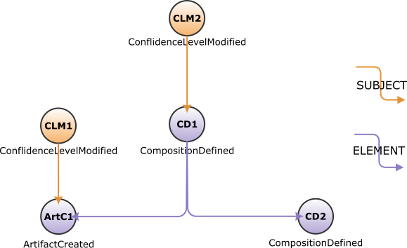

<!---
   Copyright 2023 Ericsson AB.
   For a full list of individual contributors, please see the commit history.

   Licensed under the Apache License, Version 2.0 (the "License");
   you may not use this file except in compliance with the License.
   You may obtain a copy of the License at

       http://www.apache.org/licenses/LICENSE-2.0

   Unless required by applicable law or agreed to in writing, software
   distributed under the License is distributed on an "AS IS" BASIS,
   WITHOUT WARRANTIES OR CONDITIONS OF ANY KIND, either express or implied.
   See the License for the specific language governing permissions and
   limitations under the License.
--->

# CLM for a combination of Hardware and Software

This example shows how to use
[EiffelConfidenceLevelModifiedEvent (CLM)](../eiffel-vocabulary/EiffelConfidenceLevelModifiedEvent.md)
and [EiffelCompositionDefinedEvent (CD)](../eiffel-vocabulary/EiffelCompositionDefinedEvent.md)
for describing confidence over hardware and software artifacts.

## Introduction

Eiffel has the ability to support a continuous integration and delivery pipeline
for hardware products containing software. When developing the software for the
hardware, the designer first runs test specifically for the software part. The
designer then loads the software on the hardware and runs test with both the
hardware and software. These tests produce the confidence signaled
by [CLM](../eiffel-vocabulary/EiffelConfidenceLevelModifiedEvent.md) event using
the SUBJECT link for pointing to the composition the confidence describes. This
example shows how to describe the combination of software and hardware with
confidence levels.

## Event Graph

## Event-by-Event Explanation

* `ArtC1`:
  The [EiffelArtifactCreatedEvent (ArtC)](../eiffel-vocabulary/EiffelArtifactCreatedEvent.md)
  event represents the software artifact running on the hardware.
* `CD1`:
  The [EiffelCompositionDefinedEvent (CD)](../eiffel-vocabulary/EiffelCompositionDefinedEvent.md)
  event describes the combination of hardware and software.
* `CD2`: The [CD](../eiffel-vocabulary/EiffelCompositionDefinedEvent.md) event
  describes the hardware. The event describes the type of hardware or maybe a
  recipe but not a specific device like something having a serial
  number. `data.name` describes the hardware or recipe.
* `CLM1`:
  The [EiffelConfidenceLevelModifiedEvent (CLM)](../eiffel-vocabulary/EiffelConfidenceLevelModifiedEvent.md)
  describes the confidence for the software artifact `ArtC1`. This assumes no
  dependencies on hardware when verifying the confidence.
* `CLM2`: Describes the confidence for `CD1` containing both the software and
  the hardware
