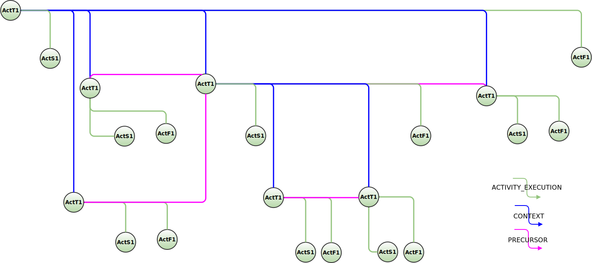

<!---
   Copyright 2022 Ericsson AB.
   For a full list of individual contributors, please see the commit history.

   Licensed under the Apache License, Version 2.0 (the "License");
   you may not use this file except in compliance with the License.
   You may obtain a copy of the License at

       http://www.apache.org/licenses/LICENSE-2.0

   Unless required by applicable law or agreed to in writing, software
   distributed under the License is distributed on an "AS IS" BASIS,
   WITHOUT WARRANTIES OR CONDITIONS OF ANY KIND, either express or implied.
   See the License for the specific language governing permissions and
   limitations under the License.
--->

# Activity Linking

This section of the usage examples focus on different ways to link activity related events in different scenarios

- [Fully Orchestrated Pipeline](./usage-examples/activity-linking/orchestrated-pipeline.md)
- [Fully Event Driven Pipeline](./usage-examples/activity-linking/event-driven-pipeline.md)
- [Event Driven and Orchestrated Pipeline Combined](./usage-examples/activity-linking/combined-pipeline.md)
- [Network of Pipelines](./usage-examples/activity-linking/network-of-pipelines.md)
    Also known as "Pipelines of pipelines" , "Full production line"

## Event Graph
