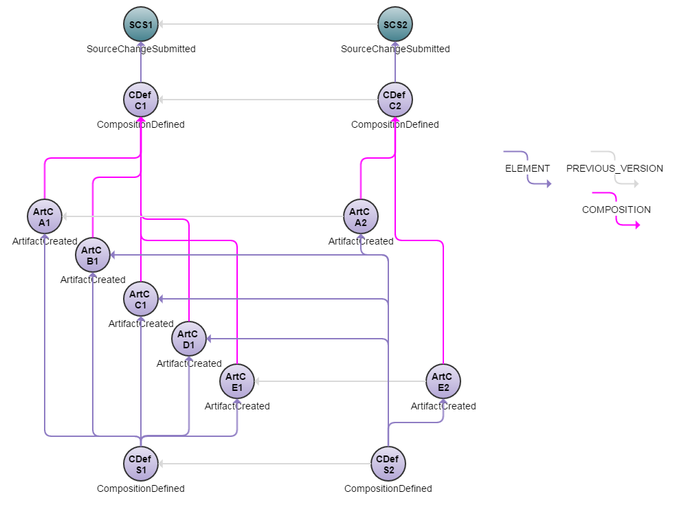

# Build Avoidance Example
This example discusses how build avoidance mechanisms can be implemented using Eiffel events.

## Introduction
A common use case in continuous integration and delivery systems is avoidance of unnecessary builds: when a number of components are built from the same source repository, one doesn't want to rebuild all of them simply because _something_ in the repo changed - instead one wants to rebuild only the parts that were affected.[1](#footnote1)

In a centralized scenario where everything is handled in a single orchestrating job, this is relatively straight forward: analyze the change, trigger the needed builds, wait for them to finish and package the result. In a decentralized continuous integration and delivery system based on descriptive - rather than prescriptive - principles a different approach is needed.

Compared to many other examples, only a very small number of link types is included: __links.elements__, __links.previousVersions__ and __links.composition__. These three are the types relevant to the example; other link types are of course legal and feasible, but not included here. 

A JSON array of all events used in this example can be found [here](https://github.com/Ericsson/eiffel-examples/blob/master/flows/build-avoidance/events.json).

## Event Graph

## Event-by-Event Explanation
### SCS1, SCS2
The [EiffelSourceChangeSubmittedEvents](../eiffel-vocabulary/EiffelSourceChangeSubmittedEvent.md) signal that source changes have been submitted to a branch of interest (typically a shared development branch or "mainline"). They would normally point to [EiffelSourceChangeCreatedEvents](../eiffel-vocabulary/EiffelSourceChangeCreatedEvent.md) documenting the change in greater detail; for the sake of brevity this has been left out of the example. 

### CDefC1, CDefC2
For each source change, a new [EiffelCompositionDefinedEvent](../eiffel-vocabulary/EiffelCompositionDefinedEvent.md) is emitted, including it in __links.elements__. Note that each composition references its predecessor via __links.previousVersions__.

### ArtCA1, ArtCB1, ArtCC1, ArtCD1, ArtCE1
The [EiffelArtifactCreatedEvents](../eiffel-vocabulary/EiffelArtifactCreatedEvent.md) representing the set of components (__A__, __B__, __C__, __D__ and __E__) built from __CDefC1__. In this example it is assumed that each component is built independently in a decentralized fashion, and that each such build determines whether a new artifact is needed. Strategies for making that decision are discussed below.

### ArtCA2, ArtCE2
The [EiffelArtifactCreatedEvents](../eiffel-vocabulary/EiffelArtifactCreatedEvent.md) representing the two artifacts built from __CDefC2__. Again, each component is built independently. In this case, artifacts __A__ and __E__ are rebuilt.

### CDefS1, CDefS2
There are the [EiffelCompositionDefinedEvents](../eiffel-vocabulary/EiffelCompositionDefinedEvent.md) defining the larger system composed of components __A__, __B__, __C__, __D__ and __E__: whenever all components required to be rebuilt for a given source change are available, a new system composition is emitted.

If one expects everything to be rebuilt this is trivial; one simply waits until all component artifacts (__ArtCA1__ though __ArtCE1__) to be completed. In this scenario, however, any of the constituent components may be skipped, so how does one determine when to issue a new [EiffelCompositionDefinedEvent](../eiffel-vocabulary/EiffelCompositionDefinedEvent.md) and which component artifacts to include in it?

There are several approaches to this problem, of which we will discuss two.

#### Solution 1
The first solution is a pragmatic one: let __CDefC1__ and __CDefC2__ determine what needs to be rebuilt, and let all downstream actors rely on that decision. Every Eiffel message allows for additional information to be included in __data.optionalParameters__ objects. By including objects documenting whether a component has been affected by the change, all logic determining what to build can be kept in one place. To exemplify, __CDefC2__ may include the following:

    "data": {
      "optionalParameters": [
        {
          "name": "aIsAffected",
          "value": "true"
        },
        {
          "name": "bIsAffected",
          "value": "false"
        },
        {
          "name": "cIsAffected",
          "value": "false"
        }
        ...
      ]
    }

Using this information each component build activity can decide whether to rebuild or not, and the issuer of __CDefC1__ and __CDefC2__ is able to simply wait until all affected components are available.
    
It is recommended to be very conservative with use of __data.optionalParameters__, however, as one can easily go overboard with it. More than once have teams used it to throw everything including the kitchen sink into events, ending up with humongous, fragile data structures that make no sense to anyone external to their own team. In this case it is justified, however, for two reasons:
1. The scope of the information is local: it is only used to inform the behavior of nearby downstream activities.
2. Traceability is still secured via standardized Eiffel links, ensuring that external stakeholders can still trace which components actually were rebuilt and what was changed from one version to the next: it's only _in situ_ that the extra __data.optionalParameters__ information is relevant.

Note that the name of the optional parameters are "aIsAffected", "bIsAffected" et cetera, rather than e.g. "aNeedsToBeRebuilt". This is a minor point of little practical significance, but rather a gesture of adhering to the principle of descriptive events: it is not __CDefC2__'s job to prescribe the actions of downstream agents, but to provide them the information they need to make educated decisions.

#### Solution 2
The second solution does not make use of __data.optionalParameters__. Instead each component build activity determines whether to rebuild by following the __links.previous__ from __CDefC2__ to __CDefC1__ and comparing their respective [EiffelSourceChangeSubmittedEvents](../eiffel-vocabulary/EiffelSourceChangeSubmittedEvent.md).

__CDefS1__ and __CdefS2__ similarly compare the changes in order to determine which component artifacts to include in the new composition, and consequently which artifacts to wait for.

This approach minimizes redundancy of information in Eiffel events and does not introduce any non-standardized concepts, instead relying on the intelligent and correct behavior of each actor. Its weakness, however, is that the same decision of whether to rebuild a component must be taken by multiple agents, and if they do not come to the same conclusion the system composition (__CDefS2__) will either never be defined, waiting indefinitely for artifacts that will never be built, or it will be defined too early, omitting unexpected artifacts.

&nbsp;
&nbsp;

------------------
&nbsp;

<a name="footnote1">1</a>: Some will argue that this situation is to be avoided, and that a better option is to split the source into multiple repositories. While not arguing the point, this may or may not be a feasible option, and so one makes the best of the cards one is dealt.
