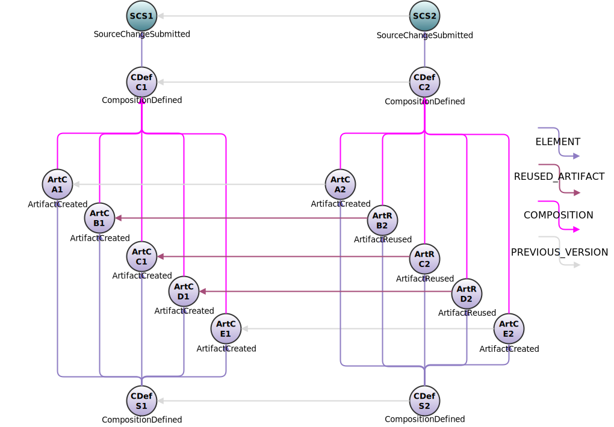

<!---
   Copyright 2017 Ericsson AB.
   For a full list of individual contributors, please see the commit history.

   Licensed under the Apache License, Version 2.0 (the "License");
   you may not use this file except in compliance with the License.
   You may obtain a copy of the License at

       http://www.apache.org/licenses/LICENSE-2.0

   Unless required by applicable law or agreed to in writing, software
   distributed under the License is distributed on an "AS IS" BASIS,
   WITHOUT WARRANTIES OR CONDITIONS OF ANY KIND, either express or implied.
   See the License for the specific language governing permissions and
   limitations under the License.
--->

# Build Avoidance Example
This example discusses how build avoidance mechanisms can be implemented using Eiffel events.

## Introduction
A common use case in continuous integration and delivery systems is avoidance of unnecessary builds: when a number of components are built from the same source repository, one doesn't want to rebuild all of them simply because _something_ in the repo changed - instead one wants to rebuild only the parts that were affected.[1](#footnote1)

In a centralized scenario where everything is handled in a single orchestrating job, this is relatively straight forward: analyze the change, trigger the needed builds, wait for them to finish and package the result. In a decentralized continuous integration and delivery system based on descriptive (rather than prescriptive) principles a different approach is needed.

Compared to many other examples, only a very small number of link types is included: __ELEMENT__, __PREVIOUS_VERSION__, __REUSED_ARTIFACT__ and __COMPOSITION__. These four are the types relevant to the example; other link types are of course legal and feasible, but not included here.

A JSON array of all events used in this example can be found [here](../examples/flows/build-avoidance/events.json).

## Event Graph

## Event-by-Event Explanation
### SCS1, SCS2
The [EiffelSourceChangeSubmittedEvents](../eiffel-vocabulary/EiffelSourceChangeSubmittedEvent.md) signal that source changes have been submitted to a branch of interest (typically a shared development branch or "mainline"). They would normally point to [EiffelSourceChangeCreatedEvents](../eiffel-vocabulary/EiffelSourceChangeCreatedEvent.md) documenting the change in greater detail; for the sake of brevity this has been left out of the example.

### CDefC1, CDefC2
For each source change, a new [EiffelCompositionDefinedEvent](../eiffel-vocabulary/EiffelCompositionDefinedEvent.md) is emitted, including it in __ELEMENT__ links. Note that each composition references its predecessor via a __PREVIOUS_VERSION__ link.

### ArtCA1, ArtCB1, ArtCC1, ArtCD1, ArtCE1
The [EiffelArtifactCreatedEvents](../eiffel-vocabulary/EiffelArtifactCreatedEvent.md) representing the set of components (__A__, __B__, __C__, __D__ and __E__) built from __CDefC1__. In this example it is assumed that each component is built independently in a decentralized fashion, and that each such build determines whether a new artifact is needed. Strategies for making that decision are discussed below.

### ArtCA2, ArtCE2
The [EiffelArtifactCreatedEvents](../eiffel-vocabulary/EiffelArtifactCreatedEvent.md) representing the two artifacts built from __CDefC2__. Again, each component is built independently. In this case, artifacts __A__ and __E__ are rebuilt.

### ArtRB2, ArtRC2, ArtRD2
The [EiffelArtifactReusedEvents](../eiffel-vocabulary/EiffelArtifactReusedEvent.md) declaring that components __B__, __C__ and __D__ were in fact not rebuilt for composition __CDefC2__, but that an already existing artifact is logically equivalent and therefore reused. These events use two links to declare this: __COMPOSITION__ and __REUSED_ARTIFACT__.

### CDefS1, CDefS2
There are the [EiffelCompositionDefinedEvents](../eiffel-vocabulary/EiffelCompositionDefinedEvent.md) defining the larger system composed of components __A__, __B__, __C__, __D__ and __E__: whenever all components required to be rebuilt for a given source change are available, a new system composition is emitted.

## Build Avoidance Solution
As discussed in the introduction, in a centralized scenario where a single actor controls the entire process end-to-end, arranging this type of build avoidance is trivial. In a distributed and heterogeneous scenario it is more complicated, as one actor cannot be assumed to, and indeed should not, know more than its immediate concerns. In other words, the actor defining __CDefS1__ and __CDefS2__ does not know who builds or does not build components __A__, __B__, __C__, __D__ or __E__ or on which basis that decision is made. Conversely, the builders of the components do not presume to know who will be using them: they are ignorant of the system level, and may indeed be included in any number of downstream compositions. How then does one determine when to issue a new [EiffelCompositionDefinedEvent](../eiffel-vocabulary/EiffelCompositionDefinedEvent.md) and which component artifacts to include in it?

Facing this scenario it is easy to turn to either prescriptive solutions (e.g. __CDefC1__ and __CDefC2__ instructing downstream actors what to do) or convention based solutions (e.g. __B__ is usually wrapped in Activity events, so a set of Activity events without an [EiffelArtifactCreatedEvent](../eiffel-vocabulary/EiffelArtifactCreatedEvent.md) is interpreted as a skipped build). The Eiffel protocol supports this scenario through [EiffelArtifactReusedEvents](../eiffel-vocabulary/EiffelArtifactReusedEvent.md), however.

Whenever a component builder creates a new artifact it issues an [EiffelArtifactCreatedEvent](../eiffel-vocabulary/EiffelArtifactCreatedEvent.md), but when it decides _not_ to it instead issues an [EiffelArtifactReusedEvent](../eiffel-vocabulary/EiffelArtifactReusedEvent.md). This allows the system level to follow a single very simple rule: whenever a relevant [EiffelCompositionDefinedEvent](../eiffel-vocabulary/EiffelCompositionDefinedEvent.md) has been linked to by either an [EiffelArtifactCreatedEvent](../eiffel-vocabulary/EiffelArtifactCreatedEvent.md) or an [EiffelArtifactReusedEvents](../eiffel-vocabulary/EiffelArtifactReusedEvent.md) for each component, define a new system level composition.

### A Note on Link Traversal
If one wishes to find changes that were included in a given system revision in this scenario, there are two options which produce different results.

If one is only interested in what is new in the given system revision (e.g. finding out which issues have been addressed since the previous version) one can follow __ELEMENT__ and __COMPOSITION__ links to any source changes.

If instead one wants to find all source revisions included in the system revision, regardless of whether they are new or old, one also includes any __REUSED_ARTIFACT__ links in the query.

&nbsp;
&nbsp;

------------------
&nbsp;

<a name="footnote1">1</a>: Some will argue that this situation is to be avoided, and that a better option is to split the source into multiple repositories. While not arguing the point, this may or may not be a feasible option, and so one makes the best of the cards one is dealt.
