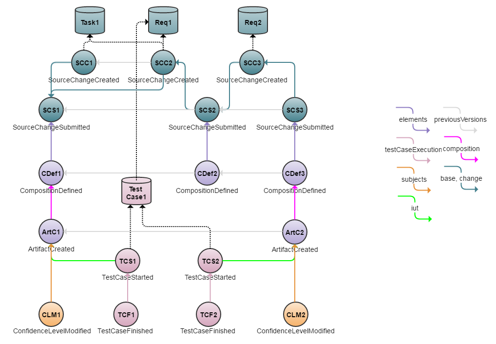

# Delivery Interface Example
Eiffel messaging can favorably be used to implement software delivery interfaces between products and organizations. This is typically achieved by a system placing requirements on the events its constituent parts must use to communicate that they offer a new candidate for integration, and then driving that integration by reacting to those events. The Eiffel vocabulary offers considerable freedom in the level of detail of such interfaces - as always, an important principle is freedom in _what_ you communicate, but not in _how_ you communicate it. Consequently what is presented here is an example of the event usage a system may require from its constituent parts in order to ensure a satisfactory level of traceability; actual implementations may require more or less, but the essential building blocks are the same.

## Introduction
A prime concern in designing delivery interfaces is to ensure traceability across products, organizations and enterprises. From a traceability point of view the links of particular interest are typically content and quality related ones: what does this artifact contain, what has changed, has it been tested etc. Consequently this example focuses on those events and links; all causality links and activity events have been excluded. This does not mean that no such events and links may be used, however, but merely that they are not a required part of the delivery interface in this particular example.

In this example the [EiffelConfidenceLevelModifiedEvents](../eiffel-vocabulary/EiffelConfidenceLevelModifiedEvent.md) __CLM1__ and __CLM2__ are used to signal that a new candidate is considered good enough to be integrated (__ArtC1__ and __ArtC2__), while the remaining events provide context and meta-data. 

A JSON array of all events used in this example can be found [here](https://github.com/Ericsson/eiffel-examples/blob/master/flows/delivery-interface/events.json).

## Event Graph

## Event-by-Event Explanation
### SCC1, SCC2, SCC3, SCS1, SCS2, SCS3
The [EiffelSourceChangeCreatedEvents](../eiffel-vocabulary/EiffelSourceChangeCreatedEvent.md) declare that changes have been made and describe what they entail, by referencing work items, requirements et cetera. This does not mean mean that the change has been merged onto the project mainline (or other relevant branch) - this is instead declared by The [EiffelSourceChangeSubmittedEvent](../eiffel-vocabulary/EiffelSourceChangeSubmittedEvent.md). The distinction between the two is important when working with review processes, private repositories and/or pull requests. If none of that is applicable, the two events are simply sent at once.

The structure of events shown in this example represents a common development branch, where changes are represented by __SCS1__, SCS2__ and __SCS3__. Each of these submitted changes references a EiffelSourceChangeCreatedEvent via __links.change__, and also points to the latest previously submitted version(s). This establishes an unbroken chain of source revisions along with a record of the process leading up to that submission.

### CDef1, CDef2, CDef3
[EiffelCompositionDefinedEvents](../eiffel-vocabulary/EiffelCompositionDefinedEvent.md) declaring that new compositions are available to be built. Note that in this example not every composition leads to the creation of a new artifact. In industrial practice this is a common phenomenon, for which there may be a number of reasons - often there simply isn't sufficient time or resources to build each individual change.

Note that EiffelCompositionDefinedEvents may reference any number of elements: often a composition doesn't just consist of the one source revision, but a large collection of sources, binaries and third party libraries.

### ArtC1, ArtC2
The [EiffelArtifactCreatedEvents](../eiffel-vocabulary/EiffelArtifactCreatedEvent.md) representing new versions of the built software.

### TCS1, TCS2, TCF1, TCF2
[EiffelTestCaseStartedEvents](../eiffel-vocabulary/EiffelTestCaseStartedEvent.md) and [EiffelTestCaseFinishedEvents](../eiffel-vocabulary/EiffelTestCaseFinishedEvent.md) representing one test execution per artifact (__ArtC1__ and __ArtC2__, respectively). Note that management of test cases per se is not within the scope of Eiffel, but like many events EiffelTestCaseStarted is able to reference external entities. Furthermore, it is assumed in this example that these externally managed test case descriptions in turn are able to reference any requirements they verify (which is arguably good practice in any context). With those references in place, these events can be used to answer the question "Which requirements have been verified in which version of the product, and what was the outcome?".

### CLM1, CLM2
[EiffelConfidenceLevelModifiedEvents](../eiffel-vocabulary/EiffelConfidenceLevelModifiedEvent.md) signaling that a new version of this component or part of the system is deemed ready for delivery. In this example, this is the event that the next tier of the system hierarchy reacts to, and proceeds to pick up the referenced artifact (__ArtC1__ and __ArtC2__, respectively) to integrate it.

## Traceability in Practice
Analysis of the events provided in this example (and the external data sources referenced by them) can, purely from a systems integration point of view, be used to answer the following questions:
* Which test cases have succeeded and/or failed for __ArtC2__, as opposed to __ArtC1__?
* When was a certain source change first delivered?
* When was a certain requirement/feature implementation first delivered?
* Which requirements have been verified in __ArtC2__, as opposed to __ArtC1__?
* What is the source code diff from __ArtC1__ to __ArtC2__?
* Which requirements, tasks and/or features have been implemented between __ArtC1__ and __ArtC2__.

Let's take a closer look at answering the last question by going through the process one step at a time.

1. Identify the two artifact versions to be compared: __ArtC2__ and __ArtC1__.
1. Build a list of constituent EiffelSourceChangeSubmittedEvents of the newer artifact (__ArtC2__):
   1. Identify the composition of the artifact (__CDef3__).
   1. Append any EiffelSourceChangeSubmittedEvents referenced via __links.elements__ (__SCS3__).
   1. Recursively apply the process to any EiffelArtifactCreatedEvent or EiffelCompositionDefinedEvent referenced via __links.elements__ (none, in this example).
1. Repeat the process for the older artifact (__ArtC1__).
1. Identify the delta of EiffelSourceChangeSubmittedEvents between the two lists ({__SCS3__} and {__SCS1__}, respectively):
   1. Remove any EiffelSourceChangeSubmittedEvents present in both lists (none, in this example).
   1. Include any remaining EiffelSourceChangeSubmittedEvents in the newer list (__SCS3__).
   1. Recursively follow __links.previousVersions__ of these events, including everything up until anything in the list of the old version (in this example, yielding __SCS2__).
   1. Any events in the list of the old version not hit upon represent deletions.
1. The resulting delta is {__SCS3__, __SCS2__}.
1. For each EiffelSourceChangeSubmittedEvent in the list, follow __links.change__ to its corresponding EiffelSourceChangeCreatedEvent.then append to the final output all elements of their __data.issues__ arrays ({__Req2__, __Req1__, __Task1__}). Note that these objects contain a field describing the _transition_ of the issue (i.e. what happened to it as a consequence of the source change - was it completed or removed?); for more information, see [EiffelSourceChangeCreatedEvent](../eiffel-vocabulary/EiffelSourceChangeCreatedEvent.md).
1. Repeat the process for the list of deletions and append any issues thus discovered, but inverting the transition.

Following these steps we find that __Req2__, __Req1__ and __Task1__ were completed between __ArtC1__ and __ArtC2__. Furthermore, this information is propagated throughout the enterprise and persistently stored, regardless of the issue handling tools or processes used by the individual development unit.