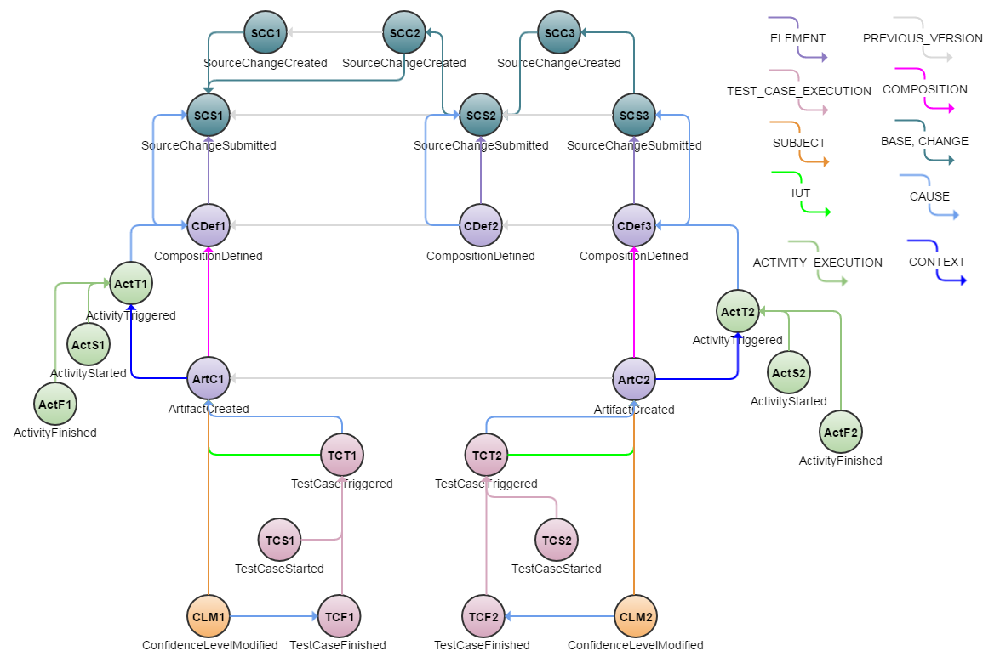

<!---
   Copyright 2017 Ericsson AB.

   Licensed under the Apache License, Version 2.0 (the "License");
   you may not use this file except in compliance with the License.
   You may obtain a copy of the License at

       http://www.apache.org/licenses/LICENSE-2.0

   Unless required by applicable law or agreed to in writing, software
   distributed under the License is distributed on an "AS IS" BASIS,
   WITHOUT WARRANTIES OR CONDITIONS OF ANY KIND, either express or implied.
   See the License for the specific language governing permissions and
   limitations under the License.
--->

# Pipeline Monitoring Example
This example discusses ways in which the continuous integration and delivery pipeline can be monitored using Eiffel events.

## Introduction
A crucial concern in any continuous integration and delivery pipeline is transparency: the ability to see what is going on, find areas of improvement and detect any issues sooner rather than later. An important capability to allow that type of transparency is real time traceability - the kind of traceability the Eiffel protocol has been designed for. But having the information isn't enough, one must be able to analyze it, make sense of it and present in a coherent and conducive manner.

The image below shows an event graph from such a pipeline. In it, source changes are created, submitted, included in comspositions and built into artifacts. These artifacts are then tested, and depending on the outcome of those tests a confidence level is issued. The image shows several iterations in this pipeline: the first source change is built into a new artifact, while the second and third source changes are batched into a single artifact.

In this pipeline, numerous relevant questions can be posed: what is the lead time from a source change being committed until it is submitted, how long do builds and tests take, what is the lead time from a source change being submitted until it is included in a successfully tested artifact, how many source changes are submitted over time, where in the pipeline is a particular bug fix right now, et cetera. All of these and more are discussed below.

One might object that such reports can be generated from e.g. the CI server: what's the need for Eiffel? This is true in some cases, but many of the questions take a holistic end-to-end view, where multiple tools are involved. In these cases it's not enough to query a single tool. Rather, a method to collect information from multiple sources, tying them all together, is needed, and that is what Eiffel provides.

In addition, what if one doesn't have just one SCM system, but several? Or not one issue tracking system, but several? Or not just one type of CI server? Particularly in large scale contexts, this is often the case. And when one inevitably decides to replace one of those tools with another one, or move them from one location or cloud provider to another? How does one do that without wrecking the metrics reporting system? Again, Eiffel as a tool agnostic communication protocol helps mitigate these problems.

## Event Graph

## Event-by-Event Explanation
### SCC1, SCC2, SCC3, SCS1, SCS2, SCS3
The [EiffelSourceChangeCreatedEvents](../eiffel-vocabulary/EiffelSourceChangeCreatedEvent.md) declare that changes have been made and describe what they entail, by referencing work items, requirements et cetera. This does not mean mean that the change has been merged onto the project mainline (or other relevant branch) - this is instead declared by the [EiffelSourceChangeSubmittedEvent](../eiffel-vocabulary/EiffelSourceChangeSubmittedEvent.md). The distinction between the two is important when working with review processes, private repositories and/or pull requests. If none of that is applicable, the two events are simply sent at once.

The structure of events shown in this example represents a common development branch, where changes are represented by __SCS1__, __SCS2__ and __SCS3__. Each of these submitted changes references a EiffelSourceChangeCreatedEvent via __CHANGE__ links, and also points to the latest previously submitted version(s). This establishes an unbroken chain of source revisions along with a record of the process leading up to that submission.

### CDef1, CDef2, CDef3
[EiffelCompositionDefinedEvents](../eiffel-vocabulary/EiffelCompositionDefinedEvent.md) declaring that new compositions are available to be built. Note that in this example not every composition leads to the creation of a new artifact. In industrial practice this is a common phenomenon, for which there may be a number of reasons - often there simply isn't sufficient time or resources to build each individual change.

Note that EiffelCompositionDefinedEvents may reference any number of elements: often a composition doesn't just consist of the one source revision, but a large collection of sources, binaries and third party libraries.

### ActT1, ActT2, ActS1, ActS2, ActF1, ActF2
[EiffelActivityTriggeredEvents](../eiffel-vocabulary/EiffelActivityTriggeredEvent), [EiffelActivityStartedEvents](../eiffel-vocabulary/EiffelActivityStartedEvent) and [EiffelActivityFinishedEvents](../eiffel-vocabulary/EiffelActivityFinishedEvent), in this example representing build activities. Using its __CONTEXT__ link, the [EiffelArtifactCreatedEvents](../eiffel-vocabulary/EiffelArtifactCreatedEvent.md) __ArtC1__ and __ArtC2__ declare that they are part of the activity.

### ArtC1, ArtC2
The [EiffelArtifactCreatedEvents](../eiffel-vocabulary/EiffelArtifactCreatedEvent.md) representing new versions of the built software.

### TCS1, TCS2, TCF1, TCF2
[EiffelTestCaseStartedEvents](../eiffel-vocabulary/EiffelTestCaseStartedEvent.md) and [EiffelTestCaseFinishedEvents](../eiffel-vocabulary/EiffelTestCaseFinishedEvent.md) representing one test execution per artifact (__ArtC1__ and __ArtC2__, respectively). Note that management of test cases per se is not within the scope of Eiffel, but like many events EiffelTestCaseStarted is able to reference external entities. Furthermore, it is assumed in this example that these externally managed test case descriptions in turn are able to reference any requirements they verify (which is arguably good practice in any context). With those references in place, these events can be used to answer the question "Which requirements have been verified in which version of the product, and what was the outcome?".

### CLM1, CLM2
[EiffelConfidenceLevelModifiedEvents](../eiffel-vocabulary/EiffelConfidenceLevelModifiedEvent.md) signaling that a new version of this component or part of the system is deemed ready for delivery. In this example, this is the event that the next tier of the system hierarchy reacts to, and proceeds to pick up the referenced artifact (__ArtC1__ and __ArtC2__, respectively) to integrate it.

## Metrics Examples
There's a multitude of metrics that are relevant to measure in a continuous integration and delivery pipeline, for various purpose and for various stakeholders. An exhaustive list is impossible, but a few examples and how they may be collected using Eiffel events are presented below.

### Lead Time from Source Change Creation to Submission
How long does it take for a source change to be submitted? In many cases this is instantaneous, but in other scenarios of extensive pre-testing and/or reviewing of any change pushed to the shared development branch or mainline, it's important to keep monitor how long this takes to ensure it doesn't get out of hand. 

Using Eiffel, this can be done as follows:
1. For every [EiffelSourceChangeSubmittedEvent](../eiffel-vocabulary/EiffelSourceChangeSubmittedEvent.md), follow its __CHANGE__ link to the corresponding [EiffelSourceChangeCreatedEvents](../eiffel-vocabulary/EiffelSourceChangeCreatedEvent.md).
1. Compare __meta.time__ of the two events.

This gives provides the lead time from the final version of the source change to its submission. If one would rather analyze the time from the first version, this can be done by following any PREVIOUS_VERSION link in [EiffelSourceChangeCreatedEvents](../eiffel-vocabulary/EiffelSourceChangeCreatedEvent.md).

### Build Duration
In the example above, the artifacts (represented by __ArtC1__ and __ArtC2__) are built in activities, represented by sets of [EiffelActivityTriggeredEvents](../eiffel-vocabulary/EiffelActivityTriggeredEvent), [EiffelActivityStartedEvents](../eiffel-vocabulary/EiffelActivityStartedEvent) and [EiffelActivityFinishedEvents](../eiffel-vocabulary/EiffelActivityFinishedEvent). It is often important to study how long such build activities take, and study the trends of such execution times.

Using Eiffel, this can be done as follows:
1. For every [EiffelActivityFinishedEvent](../eiffel-vocabulary/EiffelActivityFinishedEvent), search for its corresponding [EiffelActivityStartedEvent](../eiffel-vocabulary/EiffelActivityStartedEvent) having the same __ACTIVITY_EXECUTION__ link.
1. Compare __meta.time__ of the two events.

### Test Duration
Measuring test duration is similar to measuring build duration, and driven by similar needs. Indeed, if one is interested in the duration of a set of tests wrapped by a set of of [EiffelActivityTriggeredEvent](../eiffel-vocabulary/EiffelActivityTriggeredEvent), [EiffelActivityStartedEvent](../eiffel-vocabulary/EiffelActivityStartedEvent) and [EiffelActivityFinishedEvent](../eiffel-vocabulary/EiffelActivityFinishedEvent) one can employ the exact same method. Assuming one is interested in studying the execution time of a particular test case, however, one can use the following method:
1. For every [EiffelTestCaseFinishedEvent](../eiffel-vocabulary/EiffelTestCaseFinishedEvent.md), follow its __TEST_CASE_EXECUTION__ link to its corresponding [EiffelTestCaseStartedEvent](../eiffel-vocabulary/EiffelTestCaseStartedEvent.md).
1. Compare __meta.time__ of the two events.

### Lead Time from Source Change Submission to Successfully Tested Artifact
Rather than investigating how long it takes to get a source change submitted, a pertinent question to ask is how long it takes for that source change to end up in an product revision ready to be delivered. In the simple example depicted above, that corresponds to an artifact with an [EiffelConfidenceLevelModifiedEvent](../eiffel-vocabulary/EiffelConfidenceLevelModifiedEvent.md) having the __data.value__ property set to __SUCCESS__.

Using Eiffel, this can be done as follows:
1. For every [EiffelSourceChangeSubmittedEvent](../eiffel-vocabulary/EiffelSourceChangeSubmittedEvent.md), find a any relevant [EiffelCompositionDefinedEvents](../eiffel-vocabulary/EiffelCompositionDefinedEvent.md) linking it using the ELEMENT link type.
1. Find any relevant [EiffelArtifactCreatedEvents](../eiffel-vocabulary/EiffelArtifactCreatedEvent.md) linking to them using the __COMPOSITION__ link type.
1. Find any relevant [EiffelConfidenceLevelModifiedEvents](../eiffel-vocabulary/EiffelConfidenceLevelModifiedEvent.md) with __data.value__ set to __SUCCESS__ and linking to them using the __SUBJECT__ link type.
1. In case of no matches, find any relevant [EiffelArtifactCreatedEvents](../eiffel-vocabulary/EiffelArtifactCreatedEvent.md) linking to them using the __PREVIOUS_VERSION__ link type. Repeat previous step.

Related questions, such as the frequency of such artifacts, number of source changes included per such artifact, or the proportion of successfully tested artifacts can be answered in a similar fashion.

### Source Change Frequency
A relevant question in any continuous integration and delivery pipeline is the frequency at which source changes are being integrated: in general, in a particular part of the product or submitted by a particular individual or group of individuals.

Using Eiffel, this can be done as follows:
1. Search for relevant [EiffelSourceChangeSubmittedEvent](../eiffel-vocabulary/EiffelSourceChangeSubmittedEvent.md), e.g. filtering on __data.submitter__.
1. Count the number of hits over time.

### Real Time Bug Fix Status
It can be important not just to track source changes, but what those source changes entail, such as bug fixes. Since [EiffelSourceChangeCreatedEvents](../eiffel-vocabulary/EiffelSourceChangeCreatedEvent.md) can identify issues via its __data.issues__ property, the status of the bug fix can be monitored in real time. To exemplify, let us assume that one wants to know whether the bug fix has been included in an artifact.

Using Eiffel, this can be done as follows:
1. For any [EiffelSourceChangeCreatedEvents](../eiffel-vocabulary/EiffelSourceChangeCreatedEvent.md) containing the bug fix in __data.issues__, traverse any [EiffelSourceChangeCreatedEvent(s)](../eiffel-vocabulary/EiffelSourceChangeCreatedEvent.md) linking to them using the __PREVIOUS_VERSION__ link type.
1. Find any [EiffelSourceChangeSubmittedEvents](../eiffel-vocabulary/EiffelSourceChangeSubmittedEvent.md) linking them using the __CHANGE__ link type.
1. Traverse any subsequent [EiffelSourceChangeSubmittedEvents](../eiffel-vocabulary/EiffelSourceChangeSubmittedEvent.md) linking them using the __PREVIOUS_VERSION__ link type.
1. Find any [EiffelCompositionDefinedEvents](../eiffel-vocabulary/EiffelCompositionDefinedEvent.md) linking them using the __ELEMENT__ link type.
1. Find any [EiffelArtifactCreatedEvents](../eiffel-vocabulary/EiffelArtifactCreatedEvent.md) linking them using the __COMPOSITION__ link type.

### Activity Queuing Times
Related to the question above of build and test durations, it is sometimes important to monitor queuing times. Where resources are scarce, activities may end up in queue for long periods of time before they can be executed.

Using Eiffel, this can be done as follows:
1. For every relevant [EiffelActivityStartedEvent](../eiffel-vocabulary/EiffelActivityStartedEvent) follow its __ACTIVITY_EXECUTION__ link to its corresponding [EiffelActivityTriggeredEvent](../eiffel-vocabulary/EiffelActivityTriggeredEvent).
1. Compare __meta.time__ of the two events.

## A Note on Levels of Abstraction
The more holistic examples above, covering a larger portion of the continuous integration and delivery pipeline, include multiple steps where events linking events linking events must be searched for. This is a consequence of the fact that Eiffel events operate on a low level of abstraction: they represent atomic events, and to paint a larger picture, sometimes a large number of events must first be collected.

For this reason, dedicated services that raise the level of abstraction to concepts of greater interest are highly useful. To exemplify, a service providing a real time state of source changes, hiding the nitty gritty details of the individual events, can turn several of the queries described here into single queries by simply listening to events and aggregating them into stateful, higher abstraction level objects.