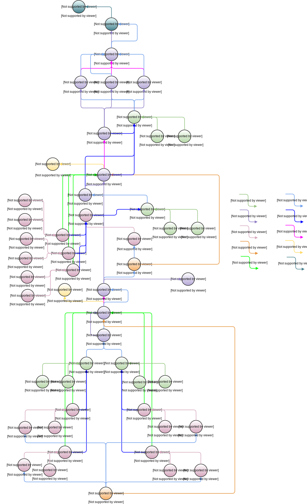

<!---
   Copyright 2017 Ericsson AB.
   For a full list of individual contributors, please see the commit history.

   Licensed under the Apache License, Version 2.0 (the "License");
   you may not use this file except in compliance with the License.
   You may obtain a copy of the License at

       http://www.apache.org/licenses/LICENSE-2.0

   Unless required by applicable law or agreed to in writing, software
   distributed under the License is distributed on an "AS IS" BASIS,
   WITHOUT WARRANTIES OR CONDITIONS OF ANY KIND, either express or implied.
   See the License for the specific language governing permissions and
   limitations under the License.
--->

# Default Reference Data Set
This is a description of the "Default" reference data set found [here](../../examples/reference-data-sets/default/events.zip).

The purpose of a reference data set is to serve as supporting documentation, but also to allow for functional and non-functional testing as well as benchmarking of implementations.

This particular data set is designed as a combination of three usage examples: [Confidence Level Joining](../confidence-level-joining.md), [Delivery Interface](../delivery-interface.md) and [Build Avoidance](../build-avoidance.md) and consists of multiple iterations through the represented continuous integration and delivery system, with certain random elements (e.g. sometimes tests fail, sometimes tests succeed). A single iteration is represented graphically below.

