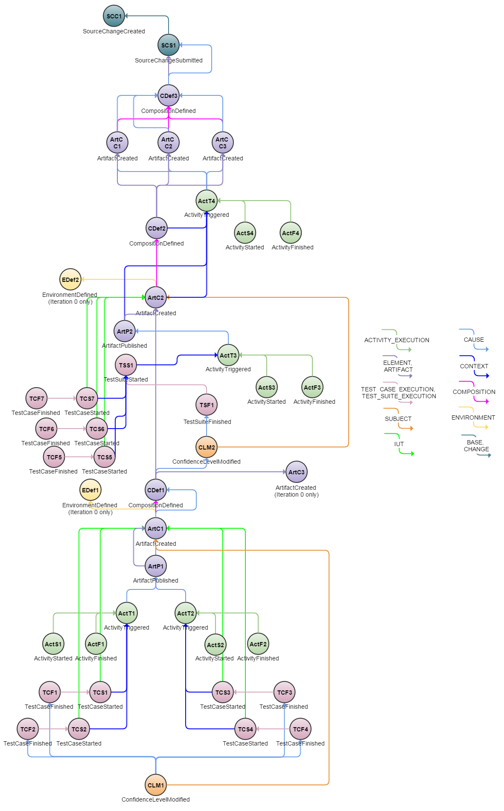

# Default Reference Data Set
This is a description of the "Default" reference data set found [here](../../examples/reference-data-sets/default.zip).

The purpose of a reference data set is to serve as supporting documentation, but also to allow for functional and non-functional testing as well as benchmarking of implementations.

This particular data set is designed as a combination of three usage examples: [Confidence Level Joining](../confidence-level-joining.md), [Delivery Interface](../delivery-interface.md) and [Build Avoidance](../build-avoidance.md) and consists of multiple iterations through the represented continuous integration and delivery system, with certain random elements (e.g. sometimes tests fail, sometimes tests succeed). A single iteration is represented graphically below.

