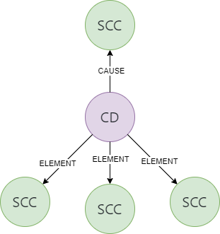

# Working with GIT submodules
This example discusses how one could build the relational tree structure representing submodules within GIT using Eiffel events.

## Introduction
A common use case in GIT is where one want to connect a relationship between repositories to be able to mirror the GIT structure as it is. The scenario could be that you have a parent repository who have one or many GIT submodule.

Below is a simple image of how it could look in GIT.

## Eiffel solution
This will show you one setup for the Eiffel model on how to get around the use-case where there is a sceanrio where GIT submodules are used.

Depending on the solution setup, a Service can be created to listen for SCCs (Source Change Created) that carry a specific identification tag/id for the Parent repository. Upon detecting such an SCC, the Service uses the SourceChange API to read the SHA IDs of contained submodules. It then fetches the related SCCs based on these IDs. Finally, it generates a CompositionDefined (CD) event and publishes it on the bus.

Important drawback from this is that it does not create a linear relationship downwards. Even though one could argue that it does, but it requires knowledge about what SCC one is suposed to query.
