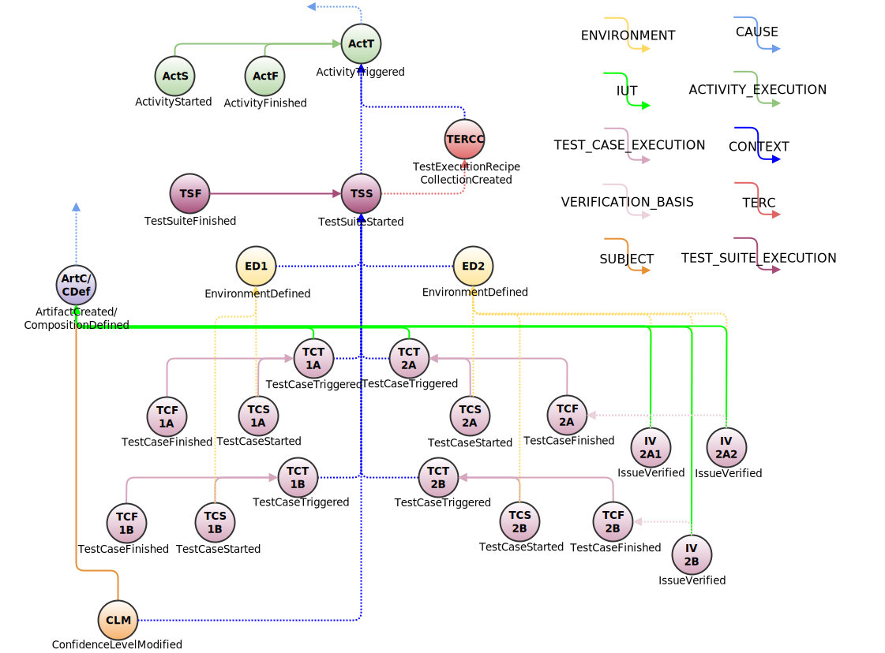

# Test Execution Example
This example presents how Eiffel events sent as part of a test activity can be connected.

## Introduction
Using Eiffel events to describe the execution of a test activity can be done in wide variety of ways and with varying numbers of events. On one extreme, a test activity can be described with Eiffel activity events only, and on the other extreme a test activity can be expanded to send a big set of Eiffel events revealing the inner details of the test activity. Which way to choose depends on the complexity of your test execution system and on the need to describe and visualize the nitty-gritty details of the test activity.

The Eiffel protocol provides several events to use within a test activity. This example shows how to make use of most of the Eiffel events related to test activities, with the purpose to present how they all are related.

To understand the example provided here, it is important to explain a few concepts (used in the sequence diagram below). While Eiffel does not make any assumptions about the underlying infrastructure and/or testing methodology, it does encourage separation of concerns. In this example, it is not the responsibility of the _Activity Orchestrator_ (e.g. the CI server) to determine the contents of the test scope, nor is it the responsibility of the _Test Executor_. Instead, the [EiffelTestExecutionRecipeCollectionCreatedEvent](../eiffel-vocabulary/EiffelTestExecutionRecipeCollectionCreatedEvent.md) makes it possible for a third actor, the _Test Manager_, to determine the test scope. A fourth actor, _Environment Provider_, is used to provide a test environment based on the needs described in the [EiffelTestExecutionRecipeCollectionCreatedEvent](../eiffel-vocabulary/EiffelTestExecutionRecipeCollectionCreatedEvent.md). The _Environment Provider_ has full control over all available test environments, and therefore the _Test Executor_ SHALL use the provided environment to run the tests towards.

## About the Example
In the example outlined here we assume that one test suite (a set of test cases) is to be executed in two different environments within the same test activity. The test suite consists of only two test cases, A and B, to keep the complexity of the event graph down. For the same reason issue verification is only performed for the test cases in environment 2.

## Event Graph

Dashed event links are optional and solid event links are mandatory.

## Event-by-Event Explanation
### ActT, ActS, ActF
[EiffelActivityTriggeredEvent](../eiffel-vocabulary/EiffelActivityTriggeredEvent.md), [EiffelActivityStartedEvent](../eiffel-vocabulary/EiffelActivityStartedEvent.md) and [EiffelActivityFinishedEvent](../eiffel-vocabulary/EiffelActivityFinishedEvent.md) are the top level events describing the status of the complete activity execution. ActT probably links to a previous event using a __CAUSE__ link showing why this activity was triggered.

### TERCC
The [EiffelTestExecutionRecipeCollectionCreatedEvent](../eiffel-vocabulary/EiffelTestExecutionRecipeCollectionCreatedEvent.md) event is sent to provide information about the contents of a test activity.

### TSS
The [EiffelTestSuiteStartedEvent](../eiffel-vocabulary/EiffelTestSuiteStartedEvent.md) signals that the execution of a set of test cases has started. The test cases defined as recipes in the [EiffelTestExecutionRecipeCollectionCreatedEvent](../eiffel-vocabulary/EiffelTestExecutionRecipeCollectionCreatedEvent.md) can be grouped to an arbitrary number of test suites. There should anyway always be one main test suite encapsulating all test cases in the activity.

### TSF
The [EiffelTestSuiteFinishedEvent](../eiffel-vocabulary/EiffelTestSuiteFinishedEvent.md) reports that the execution of the test suite is finished. This event should be sent when all test cases in the suite have finished executing. The TSF event could contain a combined verdict and conclusion for all included test cases.

### ED1, ED2
Here we assume that the test orchestrator has decided to split the complete set of test cases in two groups, each requiring their own test environment.

For each test environment set up and/or created an [EiffelEnvironmentDefinedEvent](../eiffel-vocabulary/EiffelEnvironmentDefinedEvent.md) event SHALL be sent. The environments could be static and thereby reused between a lot of test activities, or they could be created in runtime for every test activity. The latter is the typical case when testing in a cloud environment. The information needed to set up or create a test environment could be given in the TERCC event.

### ArtC/CDef
To track what item is being tested there SHALL be a link to either an [EiffelArtifactCreatedEvent](../eiffel-vocabulary/EiffelArtifactCreatedEvent.md) or to an [EiffelCompositionDefinedEvent](../eiffel-vocabulary/EiffelCompositionDefinedEvent.md) from each test case triggered. What the ArtC/CDef event links to is left out from this example, but it could for example be a __CAUSE__ link to another activity.

### TCTx
To signal that a test case is about to be executed an [EiffelTestCaseTriggeredEvent](../eiffel-vocabulary/EiffelTestCaseTriggeredEvent.md) can be sent. The TCT events in this example link to the [EiffelTestSuiteStartedEvent](../eiffel-vocabulary/EiffelTestSuiteStartedEvent.md) to enable tracking of the context in which the test cases are to be executed.

### TCSx
[EiffelTestCaseStartedEvents](../eiffel-vocabulary/EiffelTestCaseStartedEvent.md) declare that test case executions have started. They should link to the environment in which they are executed.

### TCFx
[EiffelTestCaseFinishedEvents](../eiffel-vocabulary/EiffelTestCaseFinishedEvent.md) report the verdict and conclusion of their respective test case executions.

### IVx
[EiffelIssueVerifiedEvents](../eiffel-vocabulary/EiffelIssueVerifiedEvent.md) are used to communicate the fact that a certain issue (e.g. a requirement or a bug report) has been verified successfully or not. The verification is in this example linked to a [EiffelTestCaseFinishedEvent](../eiffel-vocabulary/EiffelTestCaseFinishedEvent.md) to describe what test  case that was used to verify this issue. Just as for [EiffelTestCaseStartedEvents](../eiffel-vocabulary/EiffelTestCaseStartedEvent.md), the IV events should link to the environment in which the issue is verified (it must not be the same environment as the linked test case).

### CLM
A [EiffelConfidenceLevelModifiedEvent](../eiffel-vocabulary/EiffelConfidenceLevelModifiedEvent.md) is sent to declare what level of confidence was reached for the given item under test. It COULD link to the executed test suite to track what tests where performed to achieve the given confidence level.

## Test Activity Execution Implementation
The [Eiffel Sepia architecture description](https://eiffel-community.github.io/eiffel-sepia/index.html) provides [a possible sequence diagram of roles interacting](https://eiffel-community.github.io/eiffel-sepia/test-orchestration.html) to realize the execution and reporting of test cases.
To realize the event graph in this example, a sequence like the following is needed:
