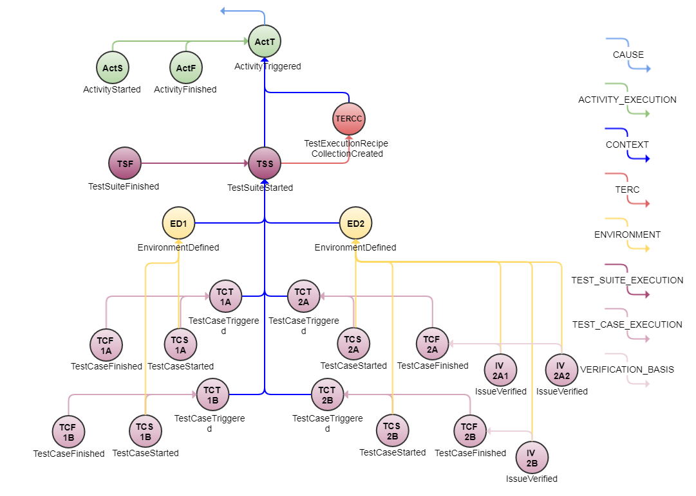

# Test Execution Example
This example presents how Eiffel events sent as part of a test activity can be connected.

## Introduction
Using Eiffel events to describe the execution of a test activity can be done in wide variety of ways. On one edge, a test activity can be described with Eiffel activity events only, and on the other edge a test activity can be expanded to send a big set of Eiffel events revealing the inner details of the test activity. Which way to choose depends on the complexity of your test execution system and on the need to describe and maybe visualize the nitty-gritty details of the test activity.

The Eiffel protocol provides several events to use within a test activity. This example shows how to make use of most of the Eiffel events related to test activities, with the purpose to present how they all are related.

## Event Graph

## Event-by-Event Explanation
### ActT, ActS, ActF
[EiffelActivityTriggeredEvent](../eiffel-vocabulary/EiffelActivityTriggeredEvent.md), [EiffelActivityStartedEvent](../eiffel-vocabulary/EiffelActivityStartedEvent.md) and [EiffelActivityFinishedEvent](../eiffel-vocabulary/EiffelActivityFinishedEvent.md) are the top level events describing the status of the complete activity execution.

### TERC
The [EiffelTestExecutionRecipeCollectionEvent](../eiffel-vocabulary/EiffelTestExecutionRecipeCollectionEvent.md) event is sent to provide information about the contents of a test activity.

### EDef1, EDef2
For each test environment set up and/or created an [EiffelEnvironmentDefinedEvents](../eiffel-vocabulary/EiffelEnvironmentDefinedEvent.md) event SHALL be sent. The environments could be static and thereby reused between a lot of test activities, or they could be created in runtime for every test activity. The latter is the typical case when testing in a cloud environment.

### TSS1, TSS2
The [EiffelTestSuiteStartedEvents](../eiffel-vocabulary/EiffelTestSuiteStartedEvent.md) signal that the execution of a set of test cases have started. There may be several such sets defined as "recipes" in the [EiffelTestExecutionRecipeCollectionEvent](../eiffel-vocabulary/EiffelTestExecutionRecipeCollectionEvent.md) event. Each of those sets could have their own constraints on the environment in which they should be executed, defined by the _constraints_ parameter in the _recipe_ object in the [EiffelTestExecutionRecipeCollectionEvent](../eiffel-vocabulary/EiffelTestExecutionRecipeCollectionEvent.md). The environment used when executing the test suite SHALL be defined using [EiffelEnvironmentDefinedEvents](../eiffel-vocabulary/EiffelEnvironmentDefinedEvent.md)

### TCS1A, TCS1B2, TCS2A, TCS2B
[EiffelTestCaseStartedEvents](../eiffel-vocabulary/EiffelTestCaseStartedEvent.md) declaring that, as part of their respective activities, test cases have been launched. Test cases are normally contained within a test suite, declared by [EiffelTestSuiteStartedEvents](../eiffel-vocabulary/EiffelTestSuiteStartedEvent.md). In this example only a very small number of test cases are executed - in reality, these events tend to be very numerous.

### TCF1A, TCF1B, TCF2A, TCF2B
[EiffelTestCaseFinishedEvents](../eiffel-vocabulary/EiffelTestCaseFinishedEvent.md) reporting the verdict of their respective test case executions.

### TSF1, TSF2
[EiffelTestSuiteFinishedEvents](../eiffel-vocabulary/EiffelTestSuiteFinishedEvent.md) report that a complete test suite is executed.

### IV2A, IV2B
[EiffelIssueVerifiedEvents](../eiffel-vocabulary/EiffelTestCaseFinishedEvent.md) can be used to override the verdict of a test case reported in a [EiffelTestCaseFinishedEvents](../eiffel-vocabulary/EiffelTestCaseFinishedEvent.md). These events can also be used to connect one or several test case executions to one or several external issues that by these test case executions are considered verified.

## Test Activity Execution Implementation
In the example above an implementation as the following is assumed:
* A test activity first evaluates what test cases to execute and in which environment to execute them. In a simple test activity both of these values could be hard coded, but in this example we show how Eiffel events can be used to handle dynamic selections of test cases and on demand created test environments. A test management system could be queried to provide the list of test cases together with the constraints on the test environment for those test cases. This information is all included in the [EiffelTestExecutionRecipeCollectionEvent](../eiffel-vocabulary/EiffelTestExecutionRecipeCollectionEvent.md).
* Second, the environment(s) are set up. If a new environment is created for this specific execution of the test activity an [EiffelEnvironmentDefinedEvent](../eiffel-vocabulary/EiffelEnvironmentDefinedEvent.md) is issued. If a previously created environment is used, its corresponding [EiffelEnvironmentDefinedEvent](../eiffel-vocabulary/EiffelEnvironmentDefinedEvent.md) is looked up.
* Third, the recipes in the [EiffelTestExecutionRecipeCollectionEvent](../eiffel-vocabulary/EiffelTestExecutionRecipeCollectionEvent.md) are evaluated and test suites corresponding to each of them are triggered for execution which is described using [EiffelTestSuiteStartedEvents](../eiffel-vocabulary/EiffelTestSuiteStartedEvent.md). Whether the test suites are executed in parallel or in serial is of no interest to the Eiffel protocol. It's merely up to the test executor to handle it in the best way available.
The execution of each test case is surrounded by [EiffelTestCaseStartedEvents](../eiffel-vocabulary/EiffelTestCaseStartedEvent.md) and [EiffelTestCaseFinishedEvents](../eiffel-vocabulary/EiffelTestCaseFinishedEvent.md). When a complete suite of test cases is executed, a [EiffelTestSuiteFinishedEvent](../eiffel-vocabulary/EiffelTestSuiteFinishedEvent.md) is issued.
* When all test suites corresponding to the recipes in the [EiffelTestExecutionRecipeCollectionEvent](../eiffel-vocabulary/EiffelTestExecutionRecipeCollectionEvent.md) are finished, the test activity is considered finished and an [EiffelActivityFinishedEvents](../eiffel-vocabulary/EiffelActivityFinishedEvent) is sent to declare that.
* If needed, complementing test activities can be performed to verify specific issues. The verdicts of those can then be reported using [EiffelIssueVerifiedEvents](../eiffel-vocabulary/EiffelTestCaseFinishedEvent.md).