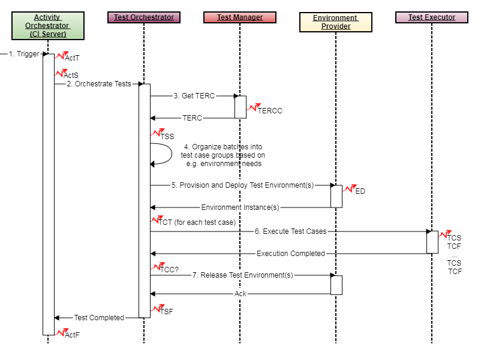

# Test Execution Example
This example presents how Eiffel events sent as part of a test activity can be connected.

## Introduction
Using Eiffel events to describe the execution of a test activity can be done in wide variety of ways. On one edge, a test activity can be described with Eiffel activity events only, and on the other edge a test activity can be expanded to send a big set of Eiffel events revealing the inner details of the test activity. Which way to choose depends on the complexity of your test execution system and on the need to describe and maybe visualize the nitty-gritty details of the test activity.

The Eiffel protocol provides several events to use within a test activity. This example shows how to make use of most of the Eiffel events related to test activities, with the purpose to present how they all are related.

To understand the example provided here, it is important to explain a few concepts (used in the sequence diagram below). While Eiffel does not make any assumptions about the underlying infrastructure and/or testing methodology, it does encourage separation of concerns. In this example, it is not the responsibility of the _Activity Orchestrator_ (e.g. the CI server) to determine the contents of the test scope, nor is it the responsibility of the _Test Executor_. Instead, the [EiffelTestExecutionRecipeCollectionCreatedEvent](../eiffel-vocabulary/EiffelTestExecutionRecipeCollectionCreatedEvent.md) makes it possible for a third actor, the _Test Manager_, to determine the test scope. Then a fourth actor, _Environment Provider_, is used to provide a test environment based on the needs described in the [EiffelTestExecutionRecipeCollectionCreatedEvent](../eiffel-vocabulary/EiffelTestExecutionRecipeCollectionCreatedEvent.md). The _Environment Provider_ has full control over all available test environments, and therefore the _Test Executor_ SHALL use the provided environment to run the tests towards.

## Event Graph

## Event-by-Event Explanation
### ActT, ActS, ActF
[EiffelActivityTriggeredEvent](../eiffel-vocabulary/EiffelActivityTriggeredEvent.md), [EiffelActivityStartedEvent](../eiffel-vocabulary/EiffelActivityStartedEvent.md) and [EiffelActivityFinishedEvent](../eiffel-vocabulary/EiffelActivityFinishedEvent.md) are the top level events describing the status of the complete activity execution.

### TERCC
The [EiffelTestExecutionRecipeCollectionCreatedEvent](../eiffel-vocabulary/EiffelTestExecutionRecipeCollectionCreatedEvent.md) event is sent to provide information about the contents of a test activity.

### TSS
The [EiffelTestSuiteStartedEvent](../eiffel-vocabulary/EiffelTestSuiteStartedEvent.md) signals that the execution of a set of test cases has started. The test cases defined as recipes in the [EiffelTestExecutionRecipeCollectionCreatedEvent](../eiffel-vocabulary/EiffelTestExecutionRecipeCollectionCreatedEvent.md) can be grouped to an arbitrary number of test suites. There should anyway always be one main test suite encapsulating all test cases in the activity.

### ED1, ED2
Here we assume the test orchestrator has decided to split the complete set of test cases in two sub test suites, each requiring their own test environment.

For each test environment set up and/or created an [EiffelEnvironmentDefinedEvents](../eiffel-vocabulary/EiffelEnvironmentDefinedEvent.md) event SHALL be sent. The environments could be static and thereby reused between a lot of test activities, or they could be created in runtime for every test activity. The latter is the typical case when testing in a cloud environment. The information needed to set up or create a test environment could be given in the TERCC event.

### TSS1, TSS2
Each sub test suite SHALL have a [EiffelTestSuiteStartedEvent](../eiffel-vocabulary/EiffelTestSuiteStartedEvent.md) sent for it. They should link to the environment in which they are to be executed, and to the main test suite of the activity. If the test orchestrator builds the test suites based on something else than their test environment needs then each test case needs to report the test environment used in their [EiffelTestCaseStartedEvents](../eiffel-vocabulary/EiffelTestCaseStartedEvent.md) instead.

### TCS1A, TCS1B, TCS2A, TCS2B
[EiffelTestCaseStartedEvents](../eiffel-vocabulary/EiffelTestCaseStartedEvent.md) declaring that, as part of their respective test suites, test cases have been launched. In this example only a very small number of test cases are executed - in reality, these events tend to be very numerous.

### TCF1A, TCF1B, TCF2A, TCF2B
[EiffelTestCaseFinishedEvents](../eiffel-vocabulary/EiffelTestCaseFinishedEvent.md) reporting the verdict of their respective test case executions.

### TSF1, TSF2
[EiffelTestSuiteFinishedEvents](../eiffel-vocabulary/EiffelTestSuiteFinishedEvent.md) report that the execution of a test suite finished.

### TSF
[EiffelTestSuiteFinishedEvent](../eiffel-vocabulary/EiffelTestSuiteFinishedEvent.md) reporting that the execution of the main test suite is finished.

### IV2A, IV2B
[EiffelIssueVerifiedEvents](../eiffel-vocabulary/EiffelIssueVerifiedEvent.md) can be used to communicate the fact that the execution of a test case has verified a certain issue (e.g. a requirement or a bug report) successfully or not.

## Test Activity Execution Implementation
To realize the event graph in this example, a sequence like this needed:

1. A test activity gets triggered by some event or timer. An [EiffelActivityTriggeredEvent](../eiffel-vocabulary/EiffelActivityTriggeredEvent.md) is immediately sent, and when the activity is ready to be executed an [EiffelActivityStartedEvent](../eiffel-vocabulary/EiffelActivityStartedEvent.md). Depending on the CI server used these events might come directly after each other, or if the CI server has an execution queue internally the first event will be sent when the activity is put in the queue and the latter when the execution starts.
2. A test orchestrator is called to separate the concerns of managing a CI avtivity from the test orchestration. This could of course be performed within the activity orchestrator unless there is a certain need to divide them.
3. The activity orchestrator listens to TSF events and awaits the main TSF event for the activity being executed.
4. The test orchestrator evaluates what test cases to execute and in which environment to execute them. In a simple test activity both of these values could be hard coded, but in this example we show how Eiffel events can be used to handle dynamic selections of test cases and on demand created test environments. A test management system could be queried to provide the list of test cases together with the constraints on the test environment for those test cases. This information is all included in a TERC document represented by the [EiffelTestExecutionRecipeCollectionCreatedEvent](../eiffel-vocabulary/EiffelTestExecutionRecipeCollectionCreatedEvent.md). A [EiffelTestSuiteStartedEvent](../eiffel-vocabulary/EiffelTestSuiteStartedEvent.md) referencing the TERCC and ActT events to inform that the actual execution is initiated.
5. The batches of test case recipes in the TERC are evaluated and test suites are formed based on for example test environment needs. 
6. For each test suite the needed test environment is provisioned and deployed. If a new test environment is created for this specific test suite an [EiffelEnvironmentDefinedEvent](../eiffel-vocabulary/EiffelEnvironmentDefinedEvent.md) is issued. If a previously created environment is used, its corresponding [EiffelEnvironmentDefinedEvent](../eiffel-vocabulary/EiffelEnvironmentDefinedEvent.md) is looked up. A [EiffelTestSuiteStartedEvent](../eiffel-vocabulary/EiffelTestSuiteStartedEvent.md) for the sub test suite is now sent, referencing the set up environment.
7. A test executor is called with the environment instance and the list of test cases to execute. The test executor executes the test cases and sends corresponding [EiffelTestCaseStartedEvents](../eiffel-vocabulary/EiffelTestCaseStartedEvent.md) and [EiffelTestCaseFinishedEvents](../eiffel-vocabulary/EiffelTestCaseFinishedEvent.md) for each of them. Whether the test suites are executed in parallel or in serial is of no interest to the Eiffel protocol. It's merely up to the test executor to handle it in the best way available.
8. The test orchestrator listens to TCF events and when all are recieved it send a [EiffelTestSuiteFinishedEvent](../eiffel-vocabulary/EiffelTestSuiteFinishedEvent.md). When done it sends a [EiffelTestSuiteFinishedEvent](../eiffel-vocabulary/EiffelTestSuiteFinishedEvent.md) corresponding to the main test suite in this test activity.
9. The used test environment is released.
10. When the main test suite has finished, the complete activity is finished and an [EiffelActivityFinishedEvent](../eiffel-vocabulary/EiffelActivityFinishedEvent.md) is sent to communicate this fact.